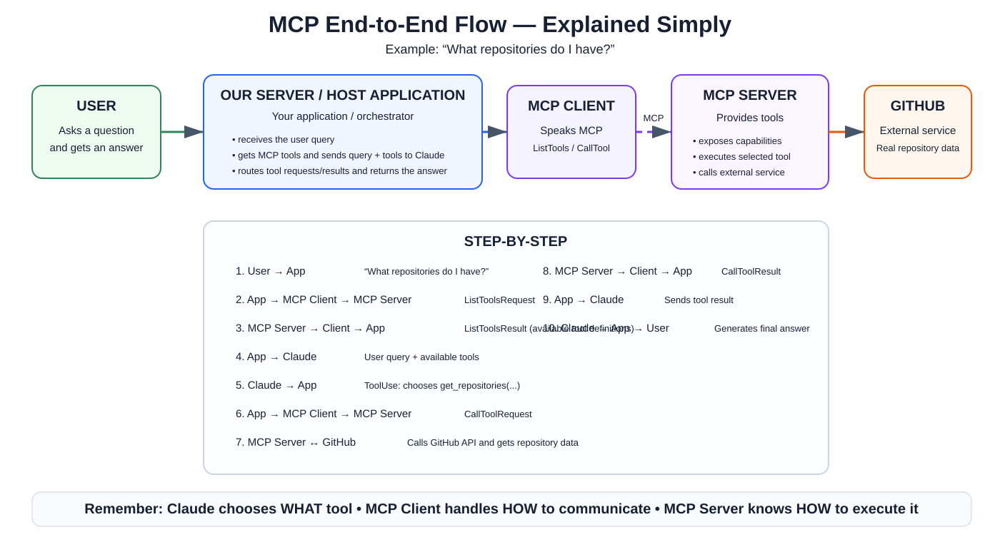

# CCAF — MCP Notes

## 2. MCP Client and Communication

### What is the MCP Client?

The **MCP client** is the communication bridge between your application (the **host application / our server**) and MCP servers.

It provides access to capabilities exposed by an MCP server and handles MCP message exchange so your application does not need to implement those protocol details itself.

```text
User
  ↓
Host Application / Our Server
  ├────────────→ Claude
  │
  └→ MCP Client ⇄ MCP Server ⇄ External Service
```

> **The MCP client is the application's access point to capabilities exposed by an MCP server.**

### What does “Our Server” mean?

**Our Server is simply the application we are building.** It is also commonly called the **host application** or **orchestrator**. It does not have to be a remote machine or cloud server.

For a local Python learning project, running something such as `uv run main.py` starts the host application on your own computer.

Its job is to coordinate the flow between:

- the user
- Claude
- the MCP client
- MCP servers

It receives the user's query, discovers MCP tools, sends the query and tool definitions to Claude, executes Claude's requested tools through the MCP client, sends tool results back to Claude, and finally returns Claude's answer to the user.

---

## Visual Overview — MCP End-to-End Flow



The diagram is easiest to understand by separating the responsibilities:

| Component | Responsibility |
|---|---|
| **User** | Asks a question and receives the final answer |
| **Our Server / Host Application** | Orchestrates the entire flow |
| **MCP Client** | Communicates with MCP servers using MCP messages |
| **MCP Server** | Exposes tools and executes them |
| **External Service** | Owns the real data/functionality, e.g. GitHub |
| **Claude** | Understands the request, chooses tools, and generates the final response |

The most important mental model is:

```text
Claude      → decides WHAT tool to use
Our Server  → coordinates the flow
MCP Client  → handles HOW to communicate using MCP
MCP Server  → knows HOW to execute the tool
GitHub      → provides the actual external data
```

---

## 1. Transport-Agnostic Communication

MCP is **transport agnostic**. This means the MCP protocol is not tied to one communication mechanism.

A common local setup uses standard input/output:

```text
Host Application
      │
  MCP Client
      │
      │ stdin / stdout
      ▼
  MCP Server
```

Depending on the implementation/setup, communication can also use network transports such as HTTP.

> **Certification point:** Do not confuse the **MCP protocol** with the **transport** carrying MCP messages.

---

## 2. Important MCP Message Types

The important message pairs introduced in this lesson are:

```text
ListToolsRequest  → ListToolsResult
CallToolRequest   → CallToolResult
```

### ListToolsRequest / ListToolsResult

Used for **tool discovery**.

```text
MCP Client
    │
    │ ListToolsRequest
    ▼
MCP Server
    │
    │ ListToolsResult
    ▼
MCP Client
```

Conceptually:

```text
Client: "What tools do you provide?"

Server:
- get_repositories
- get_pull_requests
- get_issues
- ...
```

> **ListToolsRequest discovers available tools; ListToolsResult returns their definitions.**

### CallToolRequest / CallToolResult

Used to **execute a selected tool**.

```text
MCP Client
    │
    │ CallToolRequest
    │ tool = get_repositories
    ▼
MCP Server
    │
    │ executes tool
    ▼
External Service
```

The result returns as:

```text
External Service
      │
      ▼
MCP Server
      │
      │ CallToolResult
      ▼
MCP Client
```

> **CallToolRequest asks the MCP server to execute a tool; CallToolResult contains the result.**

---

## 3. Complete MCP Tool-Use Flow

Example:

> **User: “What repositories do I have?”**

### Step 1 — User sends the query

```text
User → Our Server
"What repositories do I have?"
```

The host application receives the request.

### Step 2 — Our Server needs available tools

Before Claude can choose an MCP tool, the application needs the MCP server's tool definitions.

```text
Our Server → MCP Client
"Get the available tools"
```

### Step 3 — MCP Client discovers tools

```text
MCP Client → MCP Server
ListToolsRequest
```

The MCP client handles the MCP communication. The host application does not need to construct the low-level MCP exchange itself.

### Step 4 — MCP Server returns tool definitions

```text
MCP Server → MCP Client
ListToolsResult

MCP Client → Our Server
Available tools
```

The application might now know about tools such as `get_repositories()`.

### Step 5 — Query + tools are sent to Claude

```text
Our Server → Claude

User query
    +
Available tool definitions
```

Claude needs both the user's request and information about which tools are available.

### Step 6 — Claude chooses a tool

Claude reasons about the request and may return a tool-use request such as:

```text
Claude → Our Server
ToolUse: get_repositories(...)
```

**Claude chooses the tool. Claude does not directly call GitHub.**

### Step 7 — Our Server requests execution

```text
Our Server → MCP Client
"Run get_repositories with these arguments"
```

The host application acts as the orchestrator.

### Step 8 — MCP Client sends CallToolRequest

```text
MCP Client → MCP Server
CallToolRequest
```

### Step 9 — MCP Server calls GitHub

```text
MCP Server → GitHub API
Request repository data
```

This is where the service-specific integration happens.

GitHub returns the real repository information:

```text
GitHub API → MCP Server
Repository data
```

### Step 10 — Tool result travels back

```text
MCP Server → MCP Client
CallToolResult

MCP Client → Our Server
Tool result
```

### Step 11 — Our Server sends the result to Claude

Claude requested the tool, but it still needs to see the result:

```text
Our Server → Claude
ToolResult: repository data
```

### Step 12 — Claude creates the final answer

Claude uses the real tool data to formulate a natural-language response.

```text
Claude → Our Server → User
"Your repositories are ..."
```

---

## 4. The Flow in Three Phases

### Phase 1 — Discover tools

```text
Our Server
    ↓
MCP Client
    ↓ ListToolsRequest
MCP Server
    ↑ ListToolsResult
MCP Client
    ↑
Our Server
```

### Phase 2 — Claude chooses a tool

```text
Our Server
    ↓ Query + Tools
Claude
    ↑ ToolUse
Our Server
```

### Phase 3 — Execute the tool and return the answer

```text
Our Server
    ↓
MCP Client
    ↓ CallToolRequest
MCP Server
    ↓
GitHub
    ↑ Repository data
MCP Server
    ↑ CallToolResult
MCP Client
    ↑
Our Server
    ↓ ToolResult
Claude
    ↓ Final answer
Our Server
    ↓
User
```

---

## 5. Two Communication Layers

A useful distinction is that the architecture contains two different communication relationships:

```text
Our Server ⇄ Claude
```

and

```text
MCP Client ⇄ MCP Server
```

MCP standardizes the communication between the **MCP client and MCP server**. Your host application coordinates that MCP interaction with the Claude API interaction.

---

## Certification Takeaways

1. **The MCP client is the communication bridge** between the host application and MCP servers.
2. **Our Server means the host application/orchestrator**, not another MCP server.
3. MCP is **transport agnostic**.
4. **ListToolsRequest** asks which tools are available.
5. **ListToolsResult** returns the available tool definitions.
6. **CallToolRequest** asks the MCP server to execute a tool with arguments.
7. **CallToolResult** returns the result of that execution.
8. **Claude chooses which tool to use.**
9. **The MCP client handles MCP communication.**
10. **The MCP server implements/executes the tool and communicates with the external service.**
11. Tool results are sent back to Claude so Claude can produce the final answer.

---

## Assessment Traps

### Is “Our Server” the MCP Server?

**No.**

Our Server is the application/host/orchestrator. The MCP Server is a separate component that exposes MCP capabilities.

### Does the MCP Client implement the GitHub API logic?

**No.**

The MCP client handles MCP communication. The GitHub-specific integration belongs to the MCP server/tool implementation.

### Does Claude directly call GitHub?

**No.**

Claude selects the tool. The host application routes the request through the MCP client to the MCP server, which interacts with GitHub.

### Does MCP require HTTP?

**No.**

MCP is transport agnostic.

### ListToolsRequest vs CallToolRequest

```text
ListToolsRequest → Discover which tools exist
CallToolRequest  → Execute one of those tools
```
